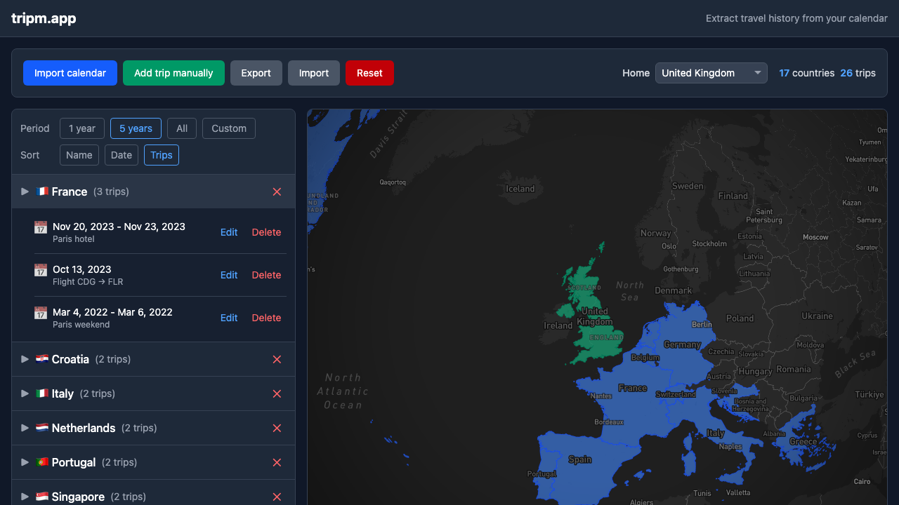

# tripm.app

A visual travel history based on events in your calendar.



## Features

- **Calendar import**: Import from .ics files, paste iCal data, or connect Google Calendar
- **Automatic detection**: Detects travel events from flights, airport codes, hotel bookings, and travel keywords
- **Map**: View visited countries on an interactive world map
- **Export/import**: Back up and restore your trip history

## Local development

```bash
# Install dependencies
npm install

# Create .env file with MapBox token
echo "VITE_MAPBOX_TOKEN=your_token_here" > .env

# Start development server
npm run dev

# Run tests
npm test

# Run all checks (tests, lint, build, e2e)
npm run check
```

## Privacy & security

**All data is processed locally in your browser.**

- Calendar data is parsed client-side using ical.js
- Trip history is stored in localStorage only
- No user data is sent to any server
- No analytics or tracking

## Tech stack

- React 19 + TypeScript
- Vite
- Tailwind CSS v4
- MapBox GL JS via react-map-gl
- ical.js for calendar parsing

## License

Apache License 2.0 - see [LICENSE](LICENSE) for details.
